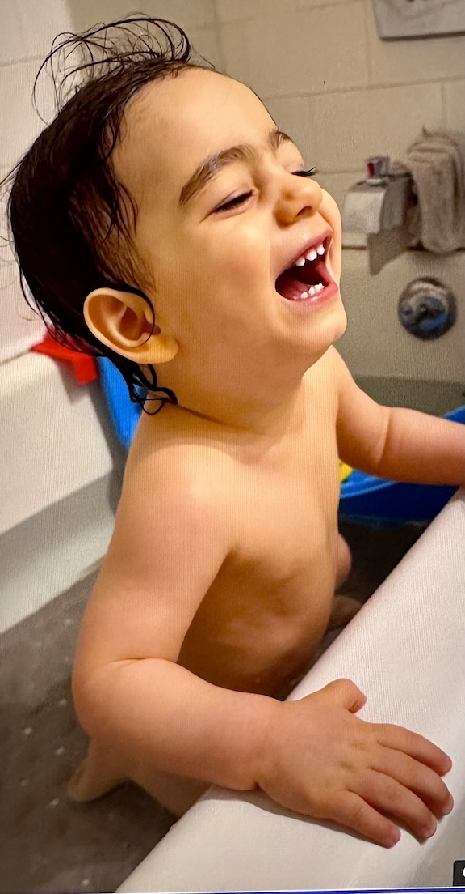

# Bath Time Pseudo Code

## Start: BathTime

**Get**:
- BabySoap
- BabyShampoo
- BabyTowel
- BabyToys
- SingingVoice
- Baby

## FillTub

- **IF** Water is too warm, use cooler water
- **Else** use warmer water
- **Determine** water temperature with elbow || thermometer
- Add BabySoap to water
- **End** FillTub

## BatheBaby

- **Start** by undressing baby
- **IF** baby is undressed **&&** ready
- Place baby in tub
- **Else** get baby ready then place baby in tub
- **IF** baby is comfortable
- Begin washing baby with BabyShampoo by lathering soap in baby hair
- **Else** get baby comfortable with SingingVoice
- **While** baby is bathing
- Give baby BabyToys
- **IF** baby's hair is clean
- Begin rinsing baby's hair with water
- **Else** keep cleaning baby hair until clean
- **Start** Washing baby with BabySoap
- **IF** baby is clean
- Begin rinsing baby with water
- **Else** keep cleaning baby with BabySoap
- **End BatheBaby**

## AfterBath
**Start** by removing baby from tub
- Wrap baby in towel
- **While** drying baby with towel sing with SingingVoice
- **IF** Baby is dry
- Begin dressing baby with diaper and clean clothes
- **Else** Continue drying baby
- Give baby to Mama
- **End** AfterBath

## CleanUp
**Begin** by draining tub
- **While** tub is draining reorganize toys
- **IF** tub is drained
- Rinse Tub
- **End** BathTime